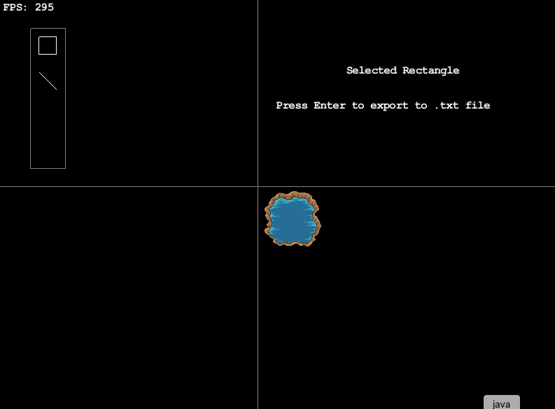

## Documentation version 0.0.1
The current game engine is built on top of LWJGL & Slick2D. The `Main` class extends `StateBasedGame` and  instantiates all of the game states, so far 2: main menu & game state. Both `MenuState` & `GameState` extend `BasicGameState`. The ID's of all states are as follows:  
  
GameState: 0  
MenuState: 1  
  
The MenuState & GameState handles rendering & updating the main menu and the in game state respectively. The GameState loads in a `Level`, which contain all ground `Tiles`, `Entities`, and the `Player`. The GameState call the `Level` instance's draw method, which will handle drawing of the world, it's objects and the player. However, the GameState takes care of keeping track of the user's movements and updating the `Player` instance using it's `posX` & `posY` variables. GameState also keeps two variables `buckyPositionX` & `buckyPositionY`. Basically, every time the player moves, the world underneath him has to move in the opposite direction. The total offset of the world is tracked by `buckyPositionX` & `buckyPositionY`. These variables are passed into the the `Level` instance's draw function.  
  
Tiled Editor is used to generate .tmx files, where each file represents either a map (without any objects), an object or a player. A `Tile` instance will take a single 32*32 .png image. `Entity` and `Level` instances will take a .tmx file to generate a 2D array of Tiles representing some type of object, like a barrel, house, etc. `Player` extends `Entity` and also uses slick2D's `Animation` class. When a `Level` instance's draw method is called, it will call draw on each of the 2D array of Tiles, it's ArrayList of Entities and on the Player, passing in the `buckyPositionX` & `buckyPositionY` to their draw methods. A `Player` instance will ignore the offsets, drawing the player on the center of the screen.

### Player Animation
A `Player` instance stores its last held orientation and will continue to draw that when the player is not moving. For example, if the player moves left and stops, his left facing orientation is stored and will render that orientation while he is not moving.

### Collision
Associated with each object or `Entity` instance is an ArrayList of Slick2D `Rectangle`s. At every update, `GameState` checks whether a collision has occurred between the player and any object using Slick2D's `intersect` method. If a collision occurs upon player movement, the movement is reversed.
### Render order
Similar to how collision works, each `Entity` holds a `renderBox` variable. The `Level` containing the `Player` also stores the player reference along with all objects in an `object` arrayList. At every draw, it sorts all objects by the Y coordinate position of each object's renderBox. Then it draws all objects from smallest to largest Y coordinate. 
  
Keep in mind, collisionBoxes and the renderBox are to be stored relative to the top right corner of the `Entity` instance's image. 

### Possible Improvements:
* Maybe remove tiles altogether and just use entire .png files. May improve performance.
* Replace collisionBoxes and RenderBoxes using Slick2D Shapes instead of Rectangles. 
* Move render sort function to `GameState`
* Change `Level` to an `extends Entity` class

## Documentation version 0.0.2
* Changed `tile` private variable inside `Entity` to include all layers from a .tmx file
* Changed the type of `collisionBoxes` inside `Entity` to `ArrayList<Shape>` & instead of checking collisions on Rectangles, collisions is checked on any slick2d Shapes now.
* Press esc to enter pause menu when inside `gameState`
* Added `Tower1` & `Cave1` classes which extend `Entity` with predefined collision and render boxes.

### How to create Levels with the `com.mason.entities` package

### Possible Improvements:
* Intersections on shapes not perfect. Ex: circle & squares. Look at this source for more details on the bug: [http://slick.ninjacave.com/forum/viewtopic.php?t=1972](http://slick.ninjacave.com/forum/viewtopic.php?t=1972)
* Special case for slick2d `Line`s when drawing & updating their position.

## Documentation version 0.0.3
### Inventory

### Collision Editor
Before, adding collision boxes to objects was really difficult. You had to load the sprite image into the `gamestate`. Then you had to hover your mouse over areas of the screen to get the dimensions of the collisionBoxes and then manually program them into a class for a particular object.  
  
Using this editor is much more intuitive and faster:  



#### How to Use:
The Collision Editor is its own slick2d game state. In `Main` open the collision Editor by adding a `collisionEditor` instance state to the `StateBasedGame`. For example:

```java
public Main(String gamename) throws SlickException {
	super(gamename);
	this.addState(new GameState(0));
	this.addState(new MenuState(1));
	this.addState(new CollisionEditor(2, "pool.tmx"));
}
```
Here, in `CollisionEditor(2, "pool.tmx")`, the 2 refers the states' ID, and "pool.tmx" is the .tmx asset file containing the sprite. Next, in `initStatesList` enter the `CollisionEditor` state instance.
```java
public void initStatesList(GameContainer arg0) throws SlickException {
		this.enterState(collisionEditor);
	}
```
Once you are satisfied with your collision Boxes, you can export them to a .txt file by pressing Enter.
The `Entity` class provides a method called `loadCollisionFile` for automatically adding collision Boxes using the .txt file created by the collisionEditor.

#### Controls:
* Drag the screen around by holding down right click and dragging your mouse
* Zoom in and out using your scroll wheel
* Click either the Rectangle or Line (just those for now) to select the the type of collision Box
* Left Click and drag the mouse and release to draw a collision Box (or line)
* Undo a collision Box typing CTRL-Z
* Press Enter to export the collision Box dimensions to a .txt file


